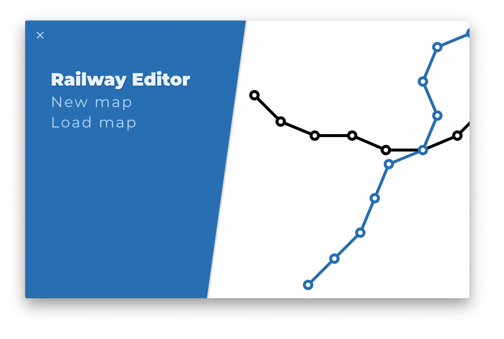
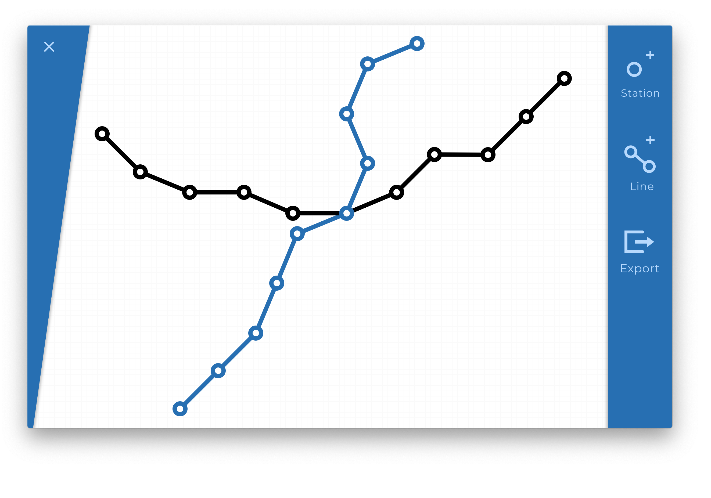

# Railway Editor

This project was made for college and for Thales Hong Kong, this is a small software to create railway systems for some Thales proprietary software.

## Available Scripts

In the project directory, you can run:

### `yarn run electron-dev`

Runs the app in the development mode. 

The page will reload if you make edits. 
You will also see any lint errors in the console.

### `yarn run electron-pack`

Builds the app for production to the `dist` folder. 
It correctly bundles React in production mode and optimizes the build for the best performance.

It packages the app for Windows, Mac Os X and Linux.
